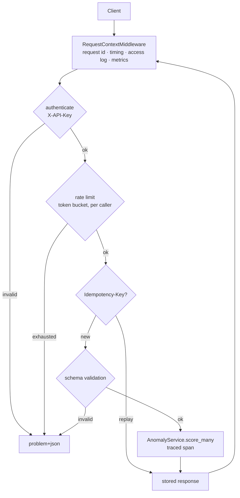
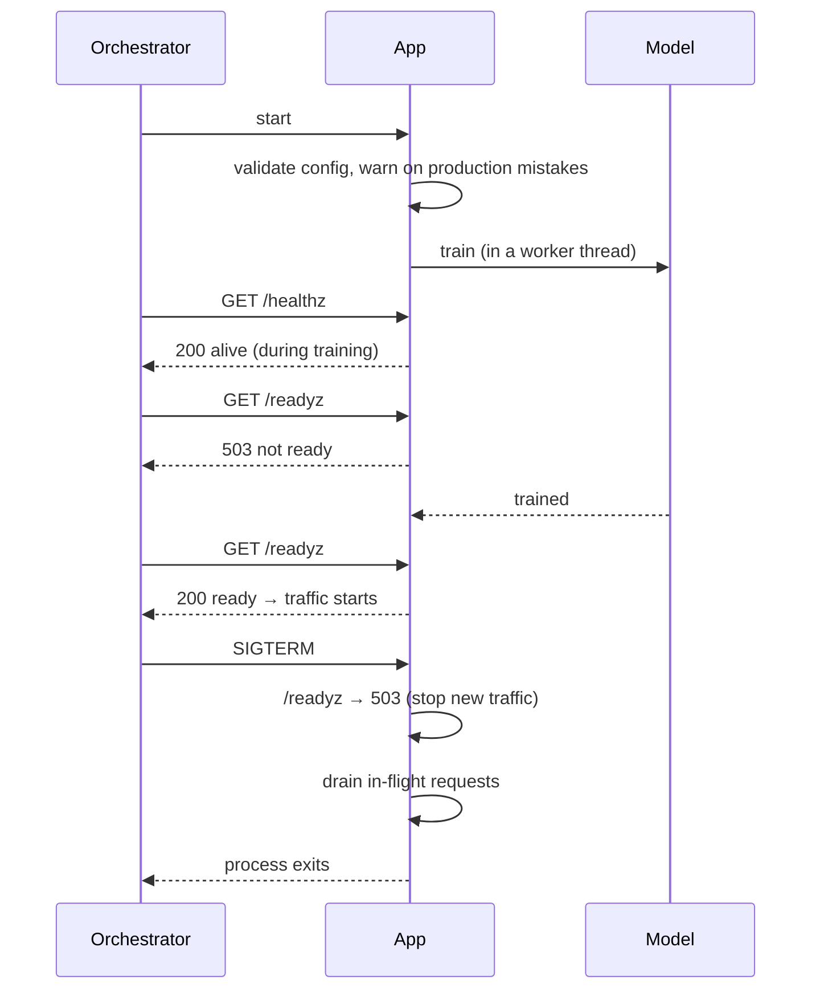

# Architecture

## Request path

Each layer is skippable by configuration and none of them knows about the
others. That is what lets the template be adapted: turn auth off for an
internal service, swap the rate limiter for a Redis-backed one, replace the
model — the layers above and below do not change.

## Why the order is what it is

**Authentication before rate limiting.** The bucket is keyed by API key, not
by IP. Limiting by IP first would let one noisy client behind a NAT gateway
exhaust the quota of everyone sharing that address, and would let a client
rotating IPs escape its own limit.

**Rate limiting before validation.** Rejecting a flood should be cheap. Parsing
a body before deciding whether the caller is allowed to send it does the
expensive work first.

**Idempotency before the model call.** The whole point is not to recompute.

## Startup and shutdown

Training runs in a worker thread rather than on the event loop, so liveness
answers during startup. A liveness probe that times out while the model trains
gets the container killed and restarted, forever.

## Module map

| Module | Responsibility |
| --- | --- |
| `app/main.py` | Wiring and lifecycle. Read this first. |
| `app/core/config.py` | All configuration, validated once. Nothing else reads the environment. |
| `app/core/context.py` | Request-scoped context vars (request id, client id). |
| `app/core/middleware.py` | Request id, timing, access log, metric labels. |
| `app/core/errors.py` | Domain errors and the RFC 9457 handlers. |
| `app/core/security.py` | API key authentication, constant-time comparison. |
| `app/core/ratelimit.py` | Token bucket, `RateLimiter` Protocol for other backends. |
| `app/core/idempotency.py` | Replay store, `IdempotencyStore` Protocol. |
| `app/core/metrics.py` | Prometheus collectors and the scrape payload. |
| `app/core/telemetry.py` | Tracing, and trace/log correlation. |
| `app/core/logging.py` | JSON formatter and the context filter. |
| `app/api/ops.py` | `/healthz`, `/readyz`, `/metrics` — unversioned on purpose. |
| `app/api/v1/` | The versioned product API. |
| `app/services/anomaly_service.py` | The model. The only file that imports scikit-learn. |
| `app/evals/` | The drift harness. Separate from the tests, for a reason. |

## Scaling notes

The rate limiter and the idempotency store are in-process. On a single
instance they are exact. Behind N replicas:

- the effective rate limit becomes N times the configured one;
- an idempotent retry replays only if it lands on the same instance.

Both are `Protocol`s precisely so a Redis-backed implementation drops in
without touching an endpoint. That work is deliberately not done here: it adds
a dependency the template does not otherwise need, and the single-instance
behaviour is correct and honest until you actually scale out.
